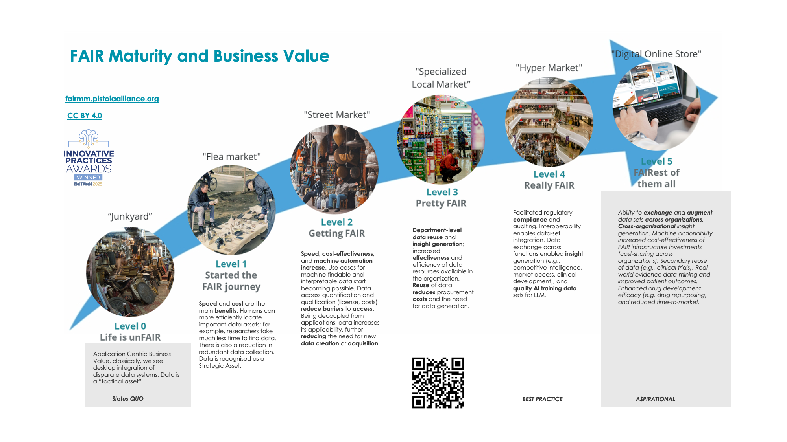

On the one hand FAIR Maturity is not a goal by itself, rather it's an approach to meet strategic business goals.
On the other hand the business benefits of FAIR implementation increase qualitatively with the maturity level. 

<iframe src="https://player.vimeo.com/video/1155013177?h=e23070d5d9&amp;app_id=122963" width="426" height="240" frameborder="0" allow="autoplay; fullscreen; picture-in-picture; clipboard-write; encrypted-media; web-share" referrerpolicy="strict-origin-when-cross-origin"></iframe>

|                     |                                                                             Junkyard                                                                           |                                                                                                    Flea market                                                                                                  |                                                                                                                                                        Street market                                                                                                                                                      |                                                                                                                                                                                                                                                                                                                                                                                                                       Local market                                                                                                                                                                                                                                                                                                                                                                                                                     |                                                                                                                                    Hyper market                                                                                                                                 |                                                                                                                                                                                                                                                                      Online store                                                                                                                                                                                                                                                                   |
| :-----------------: | :------------------------------------------------------------------------------------------------------------------------------------------------------------------------------------------------------: | :---------------------------------------------------------------------------------------------------------------------------------------------------------------------------------------------------------------------------------------------------------: | :----------------------------------------------------------------------------------------------------------------------------------------------------------------------------------------------------------------------------------------------------------------------------------------------------------------------------------------------------------------------: | :--------------------------------------------------------------------------------------------------------------------------------------------------------------------------------------------------------------------------------------------------------------------------------------------------------------------------------------------------------------------------------------------------------------------------------------------------------------------------------------------------------------------------------------------------------------------------------------------------------------------------------------------------------------------------------------------------------------------------------------------------------------------------------------------------------------------------------------------------------------------------------------------------: | :--------------------------------------------------------------------------------------------------------------------------------------------------------------------------------------------------------------------------------------------------------------------------------------------------------------------------: | :-----------------------------------------------------------------------------------------------------------------------------------------------------------------------------------------------------------------------------------------------------------------------------------------------------------------------------------------------------------------------------------------------------------------------------------------------------------------------------------------------------------------------------------------------------------------------------------------------: |
|                     |                                                                                    [**0 Life is unFAIR**](level0.md)                                                                                     |                                                                                                         [**1 Started the FAIR journey**](level1.md)                                                                                                         |                                                                                                                                                                     [**2 Getting FAIR**](level2.md)                                                                                                                                                                      |                                                                                                                                                                                                                                                                                                                                                                                                                                    [**3 Pretty FAIR**](level3.md)                                                                                                                                                                                                                                                                                                                                                                                                                                    |                                                                                                                                                [**4 Really FAIR**](level4.md)                                                                                                                                                |                                                                                                                                                                                                                                                                              [**5 FAIRest of them all**](level5.md)                                                                                                                                                                                                                                                                               |
| FAIR Business Value | This dimension is characterised by "Application Centric Business Value" creation. Typically we see desktop integration of disparate data systems. Data is treated by organisation as a “tactical asset”. | Speed and cost are the main benefits. Humans can more efficiently locate important data assets; for example, researchers take much less time to find data. There is also a reduction in redundant data collection. Data is recognised as a Strategic Asset. | Speed, cost-effectiveness, and machine automation increase. Use-cases for machine-findable and interpretable data start becoming possible. Data access quantification and qualification (license, costs) reduce barriers to access. Being decoupled from applications, data increases its applicability, further reducing the need for new data creation or acquisition. | Findability is largely achieved in the context the organization, access protocols and controls are in place. Data can be re-used at least at departmental levels. Machine interpretation is possible at the local (e.g. department) level. Processes for FAIR are formalized, including training, documentation, integration into workflow. The organization can support those processes financially and operationally. Data that increasingly comply to FAIR data principles can be generated from the onset and the organization can begin to reduce efforts required by retrospective “FAIRification”  Data exchange across functions enabled insight generation (e.g., competitive intelligence, market access, clinical development), and quality AI training data sets for LLM for example. Facilitated regulatory compliance and auditing. Interoperability enables data-set integration. on. | Data exchange across functions enables more and better quality AI training data sets for LLM. It facilitates insight generation (e.g., competitive intelligence, market access, clinical development) by humans and machines. Interoperability enables data-set integration. Facilitated regulatory compliance and auditing. | Ability to exchange and augment data sets across organizations. Cross-organizational insight generation. AI trusted actionability significantly increase. Increased cost-effectiveness of FAIR infrastructure investments via cost-sharing across organizations. Secondary reuse of data emerges . Real-world evidence data-mining and improved patient outcomes. Enhanced drug development efficacy, drug repurposing, and overall reduced time-to-market are expected. Level 5 represents the emerges a truly data centric ecosystem with interoperable and reusable data across organizations. |
|                     |                                                                          [business value  0](level0.md#level-0-business-value)                                                                           |                                                                                                    [business value  1](level1.md#level-1-business-value)                                                                                                    |                                                                                                                                                          [business value  2](level2.md#level-2-business-value)                                                                                                                                                           |                                                                                                                                                                                              [business value  3](level3.md#level-3-business-value)                                                                                                                                                                                                                                                                                                                                                                                               [business value  4](level4.md#level-4-business-value)                                                                                                                                                                                               |                                                                                                                                    [business value  5](level5.md#level-5-business-value)                                                                                                                                     |                                                                                                                                                                                                                                                                                                                                                                                                                                                                                                                                                                                                   |

We expect that future versions of the [FAIR Maturity Matrix]() will be integrated with the upcoming FAIR Business Value Framework.

