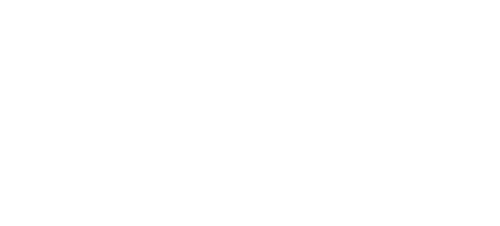

[Home](index.md) | Back to [FAIR Maturity Matrix: Dimensions (rows)](FMMdimensions.md) | Forward to [Level 0 “Life is unFAIR”](level0.md)

# FAIR Maturity Matrix: maturity levels (columns)

*   [Level 0: “life is unFAIR”](#level-0-life-is-unfair)
*   [Level 1: "Started the FAIR journey"](#level-1-started-the-fair-journey)
*   [Level 2: "Getting FAIR"](#level-2-getting-fair)
*   [Level 3: "Pretty FAIR"](#level-3-pretty-fair)
*   [Level 4:"Really FAIR"](#level-4really-fair)
*   [Level 5: "FAIRest of them all"](#level-5-fairest-of-them-all)

The working group decided to use 6 maturity levels, in alignment with other FAIR data frameworks, such as the [FAIRplus data maturity model](https://fairplus.github.io/Data-Maturity/). The levels are labeled L0 to L5. The team also gave each level a nickname to help remember it in relation to one another. (Humans are not machines.) The AstraZeneca team members introduced the “marketplace” metaphors. 

The maturity levels are the “columns” of the FAIR Maturity Matrix.

|     |     |     |     |
| --- | --- | --- | --- |
| **Level** | **Nickname** | **Marketplace metaphor** | **Key Features** |
| 0   | "Life is unFAIR" | “Junkyard” | Lack of awareness, possibly acquiring awareness. |
| 1   | "Started the FAIR journey" | "Flea market" | Awareness started, and the first pilots for implementation. |
| 2   | "Getting FAIR" | "Street Market" | Pilots for implementation are in place |
| 3   | "Pretty FAIR" | "Specialized Local Markets | Transition to good and best practice |
| 4   | "Really FAIR " | "Hyper Market" | Operational, best practice known at the time of writing. Internal organisational focus. Emerging cross-organisation |
| 5   | "FAIRest of them all" | "Digital Online Store" | Aspirational. conceivable but still needs to be realised.   Cross-organisation standards and Interoperability |

**Table - The 6 levels of the FAIR Maturity Matrix model**

It is important to note that most capabilities and features in the levels are cumulative: usually, Level N encompasses the capabilities developed in Level N-1.  There are some exceptions; for example, in the  FAIR Process dimension, “FAIRification” of historical data does not exist at low levels, appears at intermediate levels and is reduced or may even disappear at the highest levels.

### **Level 0:  “life is unFAIR”** 

|     |     |     |     |     |
| --- | --- | --- | --- | --- |
| **Level** | **Nickname** | **Marketplace metaphor** | **Key Features** | **Picture** |
| 0   | “life is unFAIR” | “Junkyard” | Lack of FAIR awareness, possibly acquiring awareness. |  |

**Table - Level 0:  “life is unFAIR”**

#### **Level 0:  “life is unFAIR” summary**

Data silos and inconsistency impede accessibility and integration, resembling a "wild west" scenario. Limited awareness and engagement hinder the adoption of FAIR principles, with minimal leadership involvement and a lack of strategic focus. A formal FAIR strategy is necessary to avoid reactive application and the absence of structured pathways. Resistance and cultural barriers may impede FAIR adoption, accompanied by a lack of FAIR-related knowledge. The organization needs FAIR processes, and implicit processes may divert efforts from FAIR implementation.

Additionally, a significant deficit in tools and infrastructure for FAIR data management contributes to unstructured data capture. A missing inventory of licenses and access policies further complicates FAIR compliance efforts. Overall, the organization has yet to start and possibly resists the initiation of a FAIR data implementation journey. [Go to level 0](level0.md)

**[(Back to the FAIR Matrix)](FAIRMaturityMatrix.md)**

### **Level 1: "Started the FAIR journey"** 

|     |     |     |     |     |
| --- | --- | --- | --- | --- |
| **Level** | **Nickname** | **Marketplace metaphor** | **Key Features** | **Picture** |
| 1   | "Started the FAIR journey." | "Flea market" | FAIR Awareness started; first pilots for implementation may appear. |  |

**Table - Level 1: "Started the FAIR journey"**

#### **Level 1: "Started the FAIR journey" summary**

At this stage, data is siloed and may reside in a shared data platform. Data has heterogeneous characteristics, requiring specialized and specific technical knowledge for access and interpretation. Leadership awareness of FAIR emerges, fostering visionary proposals for FAIR implementation and some pilots. Some strategic plans begin to take shape. Roles such as curators and semantic experts surface, with external experts engaged for training. The organization recognizes the potential business value of FAIR data, prompting considerations for retrospective implementation and specific initiatives of retrospective “FAIRification”. Discussions on metadata centralization and reference data alignment emerge, indicating a shift toward systematic approaches. Awareness among stakeholders expands through workshops. Initial plans for tooling and infrastructure emerge. Pragmatic progress involves enhancing existing IT practices. The organization focuses on centralizing metadata and implementing findability measures, marking an initial, if localized, commitment to embedding FAIR principles in some organizational processes. [Go to level 1](level1.md)

**[(Back to the FAIR Matrix)](FAIRMaturityMatrix.md)**

### **Level 2: "Getting FAIR"**

|     |     |     |     |     |
| --- | --- | --- | --- | --- |
| **Level** | **Nickname** | **Marketplace metaphor** | **Features** | **Picture** |
| 2   | "Getting FAIR" | "Street Market" | FAIR Pilots for implementation are in place |  |

**Table - Level 2: "Getting FAIR"**

#### **Level 2: "Getting FAIR" summary**

The organization initiates data conforming processes to local models in a shared data platform  and progresses to system-level controls. These processes include Tools for metadata, controlled vocabularies, and persistent identifiers. Data is more “findable” thanks to unique identifiers. Emerging metadata and controlled vocabularies make accessing data with less specific knowledge requirements possible. Leadership awareness grows, initiating initial FAIR projects and forming champions within the company. Vision, strategy, and role development follow, integrating FAIR as a key element in the broader data strategy. Designated roles emerge, fostering prototypes and showcasing value. Formal training frameworks are structured, and pilot projects and governance considerations accompany the initiation of culture change processes. Informal communities of practice begin to form, facilitating knowledge exchange. We establish Infrastructure for Proof of Concepts (POCs), leading to organization-wide plans, RFPs, and evaluations of FAIR tools and profiles. At this journey stage, an increasing commitment to FAIR data principles, encompassing leadership engagement, role development, and systematic infrastructure implementation, is present. [Go to level 2](level2.md)

**[(Back to the FAIR Matrix)](FAIRMaturityMatrix.md)**
### **Level 3: "Pretty FAIR"** 

|     |     |     |     |     |
| --- | --- | --- | --- | --- |
| **Level** | **Nickname** | **Marketplace metaphor** | **Features** | **Picture** |
| 3   | "Pretty FAIR" | “Specialized Local Markets” | FAIR Transition to good and best practice |  |

**Table - Level 3: "Pretty FAIR"**

#### **Level 3: "Pretty FAIR" summary**

FAIR data sets, adhering to domain-level models with controls on data access, increasingly appear. Machine interpretation begins to be demonstrated locally (e.g., in a department). Leadership still plays a crucial role in setting expectations for FAIR in project budgets and establishing organizational metrics related to FAIR. A refined vision and strategy exist, with an organization-wide supported plan for FAIR implementation. Key roles, such as data standard experts and curators, emerge. A cultural shift towards a data-driven approach begins to appear. Integrating Formal training into organizational practices and FAIR practices becomes ingrained in workflows, at least in some functions or departments. The organization fosters broader communities of knowledge and practice practitioners and establishes domain knowledge expertise within each key department, establishing Processes for FAIR data management. FAIR data generation and interaction mechanisms are conceptually defined. Budget and human-resources capacity is allocated for organization-wide FAIR delivery, utilising COTS (commercial, off-the-shelf) -, or “Standard” tools when possible. At this stage of the journey, the commitment to FAIR data principles shows increasing outcomes and impact, at least at the local level in the organization. [Go to level 3](level3.md)

**[(Back to the FAIR Matrix)](FAIRMaturityMatrix.md)**

### **Level 4:"Really FAIR"**

|     |     |     |     |     |
| --- | --- | --- | --- | --- |
| **Level** | **Nickname** | **Marketplace metaphor** | **Features** | **Picture** |
| 4   | "Really FAIR " | "Hyper Market" | FAIR Operational, best practice known at the time of writing. Internal organizational focus. Emerging cross-company focus. |  |

**Table - Level 4:"Really FAIR"**

#### **Level 4:"Really FAIR" summary**

This level describes the combination of currently known best achieved or achieved practices at an organizational level.

FAIR principles are pervasive across departments. Data, metadata, and identifiers conform to cross-domain standards, enabling enterprise-level interoperability and consistently implementing Globally unique, persistent identifiers (GUPRIs). Leadership mandates include FAIR budgets in all data projects and actively engage in the broader FAIR community. A comprehensive FAIR data strategy encompasses centralized and federated data backed by metrics and integrated into governance processes. Key roles, such as data standard experts and Citizen Data Scientists, play pivotal roles. Formalized training programs cover diverse roles, fostering a culture of proficiency. The organization demonstrates impact areas, engages in external leadership, and uses open-source tools. FAIR practices are embedded in workflows, emphasizing continuous improvement, impact measurement, and adherence to standards. We see the establishment of Cross-community collaboration and community of practice, highlighting shared learnings and real-world experiences. Business benefits from previous FAIR data implementation pilots are recognized, providing a qualitative framework and evaluation metrics for further initiatives. The organization utilizes automated tools, defined interaction mechanisms, and a registry of FAIRification tools, showcasing a commitment to advanced FAIR data management practices. [Go to level 4](level4.md)

**[(Back to the FAIR Matrix)](FAIRMaturityMatrix.md)**

### **Level 5: "FAIRest of them all"**

|     |     |     |     |     |
| --- | --- | --- | --- | --- |
| **Level** | **Nickname** | **Marketplace metaphor** | **Features** | **Picture** |
| 5   | "FAIRest of them all" | "Digital Online Store" | Largely aspirational: while conceivable, it still needs practical realization.  Cross-organization standards and Interoperability. |  |

**Table - Level 5: "FAIRest of them all"**

#### **Level 5:"FAIRest of them all" summary**

This level describes the aspirational, currently considered achievable practices by an entire ecosystem at the sector (life-sciences)  or ecosystem level.

At this stage, FAIR data is the norm and self-describing (FAIR) digital objects are ubiquitous for key data assets. Machine actionability and automated operations are possible, including machine-enabled AI and semantic solutions that act directly on data sets without human interpretation. The organization prioritizes adherence to FAIR data principles as a strategic and operational objective. It operates at an enterprise level, managing data granularly, focusing on data governance and master data management. It also operates at the ecosystem level, maintaining a critical set of interoperability resources with other ecosystem players (pharma, CROs, solutions providers, standardization bodies, regulatory bodies, industry associations, and academia). A minimal set of cross-organization standards platforms and tools designed to automate the creation of FAIR data, ensuring provenance capture and adherence to FAIR principles, are adopted. The organization promotes an organization-wide understanding of FAIR data, emphasizing training, defined roles, and recognition for FAIR data work. We see the integration of FAIR processes across all data processes, emphasizing value throughout the lifecycle. The organization actively shares learnings and engages in a cross-organization FAIR community of practice.

On the other hand, for most data citizens, FAIR is transparent and FAIR embeds in daily practice. Benefits are visible for key stakeholders, and a pervasive data-centric culture resists adopting application-centric solutions. The organization acts as a community leader, encouraging organization-wide adoption of FAIR data practices and platforms. At this stage, the role of complementary organizations in the ecosystem provides time, cost and qualitative benefits resulting from interoperability and data reuse. [Go to level 5](level5.md)

**[(Back to the FAIR Matrix)](FAIRMaturityMatrix.md)**

